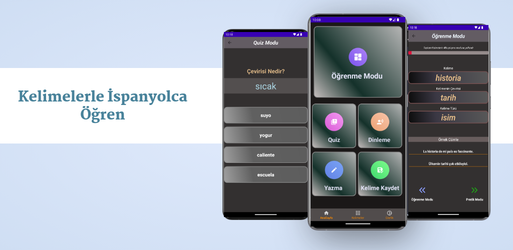

# İspanyolca Öğren
İspanyolca Öğren is a vocabulary learning app focused on helping users expand their language skills. It provides a structured way to learn and review words through various modes,such as:
- Learning Mode (Öğrenme Modu): Practice words by swiping through them, making it easier to remember and recognize vocabulary.
- Writing Mode (Yazma Modu): Enhance your writing skills by practicing spelling and word usage.
- Listening Mode (Dinleme Modu): Improve your listening skills by writing down the words you hear.
- Quiz Mode (Quiz Modu): Test your knowledge by selecting the correct answers from multiple choices.
- Word Management: Easily add, update, and track your progress on the words you are learning.

## 📚 Key Technologies and Libraries
- Java
- MVVM
- Android Jetpack (Navigation, ViewModel, LiveData, WorkManager)
- Room for Db
- Dagger Hilt
- RxJava
- Retrofit
- MPAndroidChart
- Navigation
- XML
- Serialization

## ⬇️ Installation

## 📸 Screenshots

  

     
     
     
     
     
     
     
     
  

